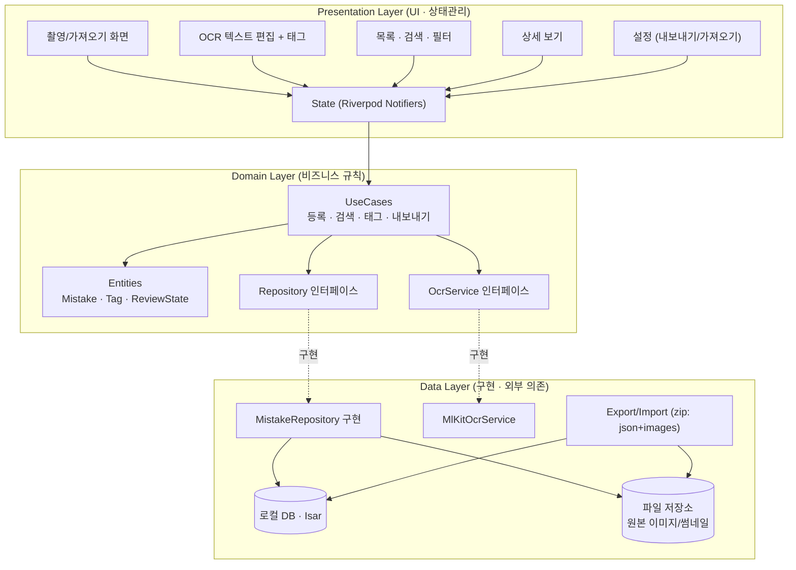
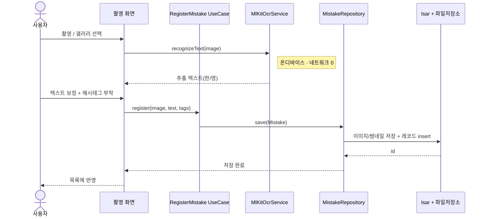
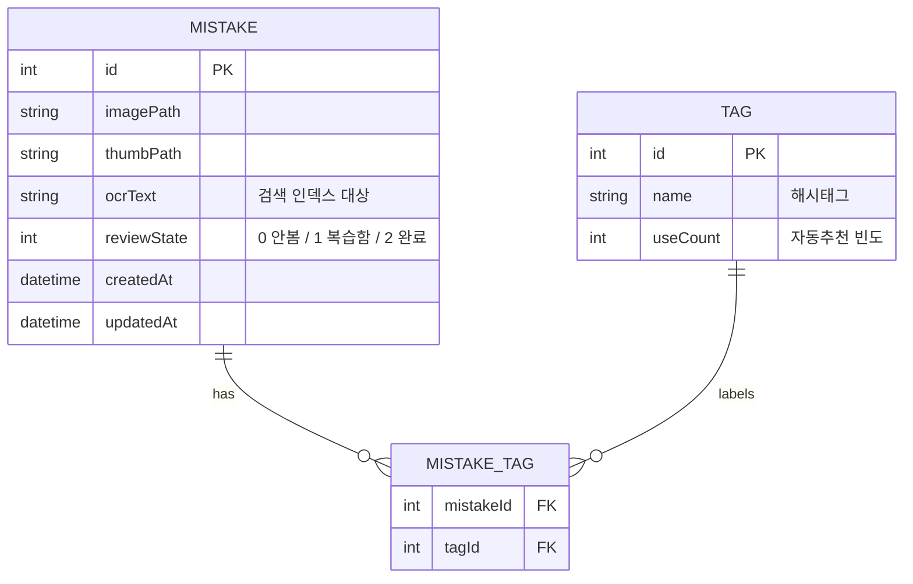

# 03 · 시스템 아키텍처 (Architecture)

오답렌즈(OdapLens) — Flutter / 온디바이스 OCR / 100% 로컬 + 수동 내보내기.
00·01·02 문서 연계. 세부 결정 근거는 `decisions/ADR-*.md` 참조.

---

## 1. 아키텍처 개요

오프라인·로컬이 전제이므로 **서버·네트워크 레이어가 없다.** 대신 기기 내부에서 *입력 → 인식 → 저장 → 검색* 이 하나의 수직 파이프라인으로 흐른다. 유지보수성과 테스트 용이성을 위해 **계층형(Clean) 아키텍처**를 채택하고, 외부 SDK(ML Kit·DB)는 도메인이 직접 의존하지 않도록 인터페이스 뒤로 감춘다. (→ ADR-0004)

## 2. 레이어 다이어그램

## 3. 핵심 흐름 — 오답 등록 (촬영 → OCR → 저장)

## 4. 데이터 모델

- **검색**: `ocrText`에 토큰 인덱스를 걸어 키워드 검색(Should). 태그 필터는 `MISTAKE_TAG` 조인.
- **정렬**: `createdAt`(최신), `reviewState`(미복습 우선), 태그별.

## 5. 모듈/레이어 설명

| 레이어 | 모듈 | 책임 |
|---|---|---|
| Presentation | 화면 5종 + Riverpod State | 입력 수집·상태 표시. 비즈니스 로직 없음 |
| Domain | UseCases / Entities | "등록·검색·태그·내보내기" 규칙. **외부 SDK 무지(無知)** |
| Domain | Repository·Ocr 인터페이스 | 데이터·인식의 추상 계약 (테스트 시 mock 주입) |
| Data | MistakeRepository | Isar + 파일저장소 조합으로 CRUD·검색 구현 |
| Data | MlKitOcrService | ML Kit 텍스트 인식 래핑. 인터페이스만 도메인에 노출 |
| Data | Export/Import | 이미지+레코드를 버전 필드 포함 zip으로 직렬화/복원 |

## 6. 횡단 관심사 (Cross-cutting)
- **오프라인 보장**: 어떤 코드도 HTTP 클라이언트를 두지 않는다. ML Kit 모델만 초기 1회 확보(번들 우선). → ADR-0002, 위험 R4
- **이미지 용량**: 원본 압축 저장 + 썸네일 분리. 목록은 썸네일만 로드. → 위험 R3
- **데이터 무결성**: 내보내기 포맷에 schemaVersion 포함, 가져오기 시 검증·롤백. → ADR-0005, 위험 R5
- **테스트성**: 도메인이 인터페이스에만 의존하므로 OCR/DB를 mock으로 대체해 단위 테스트.
